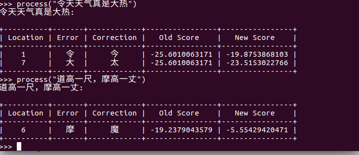

# LmCSC (Language Model-based Chinese Spelling Check)
This is an implementation of Chinese spelling check system.

## Quick Links

- [About](#about)
- [Demon](#demo)
- [Installation](#installation)

<span id="about">
## About
The system mainly consists of the following three parts:
- A Tri-gram Language Model
- Confusionset
- Other sources
</span>

<span id="demo">
## Demo
<p align="center"></p>
</span>

<span id="Installation">
## Installation
Except for some pre-installed python libraries, there some additional packages needed
to be installed in order to successfully run our system. We have listed the 
compulsory packages in the requirements.txt. Run the following commands
to clone the repository and install LmCSC:

```bash
git clone https://github.com/wdimmy/LmCSC.git
cd LmCSC; pip install -r requirements.txt; python setup.py develop

```

Note: requirements.txt includes a subset of all the possible required packages. 
Depending on what you want to run, you might need to install an extra package.

You can train the langauge model using [kenlm](https://github.com/kpu/kenlm.git), or downlowed our already trained model by run:

```bash
chmod 777 ./download.sh 
./download.sh 
```
</span>


